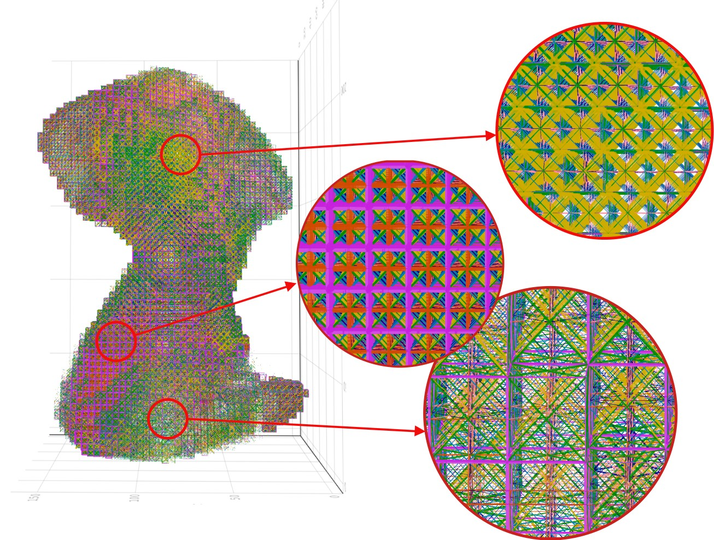

# Topology Optimization of Human hip bone with Heterogeneous Lattice Structures

## What is this about?
This work presents the multi-scale optimization of the human hip bone’s topology and microstructure considering the mechanical loads developed during the gait cycle. In other words, we take a highly constrained model of the human hip bone, mesh it with a special lattice structure and then optimise this mesh considering the loads that occur during walking.


### Why?
The human hip bone is a complex bone structure that functions as the major supporting structure for weight as well as effective transmission of load between the upper and lower body. It has spongy trabecular bones sandwiched in a thin corticular bone shell. The distribution of the trabaculae is different for each individual human. It is generated such that it has the most uniform Strain Energy Density distribution that results in a stiff structure. So far, modelling of hip bone lattice structure has been done with a single lattice which may vary in size. But, what if the lattice itself is allowed to vary? That leads us to the special lattice which has been implemented here.

### Special Lattice??
[Agarwal and Ananthasuresh’s work on optimal heterogeneity of lattice structure](http://arxiv.org/abs/2103.02047) has been adopted to reproduce the cellular structure of trabecular bone. This method achieves heterogeneity with the variation of both unit cell topology and size.

## What does this code do?
The code is written in Julia and performs the following steps.

1. Reads the mesh generated using binvox. ([BinVox](https://www.patrickmin.com/binvox/) is a program that rasterizes a model file in a 3D voxel grid. This supports exporting the model into a gmsh compatible hexahedral mesh in "msh" file format.)
2. Converts this mesh into a lattice mesh. Each unit cell is made of eight phases each of which is associated with a density parameter.
3. Applies the boundary conditions which correspond to the walking loads. This is taken as a multi load approach. There are eight different stages of walking, each applied as a static load and each of them is associated with a weight.
4. Optimises the density parameters of each phase in every lattice cell for the above loading conditions with objective of minimum compliance. There is are constraints on volume and porosity. The volume constraints are of two types. i) Based on the total mass of hip bone and ii) Based on the trabecular mass of the hip bone.
5. Visualises the optimised mesh.

## Organization of the code
In order to understand the organization of the code, you may need to go through the above linked research paper. This code is not packaged to be generic (sorry about that). But, it is still generic to some extend. In case you want to use this for something else, you may need to change the bcs.jl file and the input ".msh" file and you'll be good to go. The code here is organised in the following manner.

1. "main.jl" file is the main script of execution for optimization. All the optimization parameters are included inside this file. This file imports all the required modules and the codes are executed in order. It performs optimization and saves the output as a `JLD2` binary file.
2. "gen_ltc_msh.jl" file contains the module for generating the lattice mesh. This module also contains the function `generate_t_matrices` for generating transformation matrix which transforms each element from local coordinate to global coordinate. This is used for assembling the global stiffness matrix.
3. This in turn uses the module found in "msh_from_binvox.jl" to read the binvox generated "hip_bone_hex.msh" file. This file compensates for a small error in the file generated by binvox. If the ".msh" file is generated using some other method, edit the gen_ltc_msh file to call `mesh_from_binvox(filename, direct_from_binvox=false)`.
4. "FEA.jl" contains the `fea` function which performs the Finite Element Analysis of the mesh with Timoshenko beam elements.
5. "rho_update.jl" contains the function `get_C_U_∂K_U` to generate the compliances, stiffness sensitivity and displacements. This make use of `fea` function from the FEA module. This module also contains the `update_densities` function to update the density values based on the sensitivities and constraints. This module also contains `get_Area` function to generate the cross section area based on the length and densities.
6. "bcs.jl" contains the `bcs` module containing the `generate_neumann_bcs` function to generate neumann boundary conditions. It is a list of `neumann` object each of which contains the forces (which are only distributed in my case) and the corresponding element_ids (connections). This module also contains the `generate_dirichlet_bcs` function which returns a boolean vector of the length of number of nodes. This says whether a given node belongs to dirichlet boundary or not (as the only case under consideration is when the displacement is zero).

The above files perform the main function of optimising the code. In addition, there are certain files used for pre and post processing.

1. "savedata.jl" file saves the mesh generated by gen_ltc_msh into a `JLD2` binary file. This can be used as an input for "main" file instead of calling the `generate_lattice` function. But, there is no added advantage since `generate_lattice` function is generally fast.
2. "write_xdmf.jl" file saves the generated input lattice mesh into `xdmf` format. This is compatible with Paraview for viewing files.
3. "render_mesh.jl" uses the jld2 file generated by "main.jl" as the input and generates the visualization of the output mesh. This is done using makie library.
4. "plot_compliance.jl" plots the compliance curve from the output file.
5. "plot_compliance_comp.jl" plots the comparison plot for the two cases under consideration.
6. "phase_composition_plot.jl" plots the phase composition of the final output.


### Binaries
There are `JLD2` files of the generated lattice mesh and the optimised meshes available in the releases section of the repository. Please make use of them directly for visualization of the mesh if needed.

## Development Setup
Julia can be downloaded from [julialang.org](https://julialang.org/). The installation instruction for respective OS can be found there. I personally make use of [Visual Studio Code](https://code.visualstudio.com/) as a development IDE. If you intend to use that, install the [Julia extension](https://www.julia-vscode.org/docs/stable/gettingstarted/) for VS Code. Once it is installed, enable threads for Julia. It can be done as follows:


1. Open settings in VS code (shortcut: <kbd>Ctrl</kbd> + <kbd>,</kbd>)
2. Search for "threads". Click on "Edit in settings.json" under Julia: Num threads (refer above pic).
3. Set `"julia.NumThreads": 16` change 16 to whatever number of threads available in your system.

If you are using Julia from terminal, call Julia with the following

```
julia --threads=auto
```

### Dependencies
The following packages are being used in the code. Copy paste the following code into Julia REPL (prompt) to install all the recommended packages.

```Julia
import Pkg;
main_pkgs = ["Gmsh", "DataFrames", "CSV", "JLD2", "Plots", "GeometryBasics", "GLMakie", "Colors"];
optional_pkgs = ["MKL", "Krylov"];
Pkg.add(main_pkgs);
Pkg.add(optional_pkgs);
```
Though MKL is listed as optional, it is called in FEA.jl file. If MKL library is not available in your system, simply comment out the `using MKL` line in FEA.jl. Krylov is a iterative solver for linear systems. If the system is very large Krylov's `cg` function can be used to replace `cholesky` inside the `fea` function.


